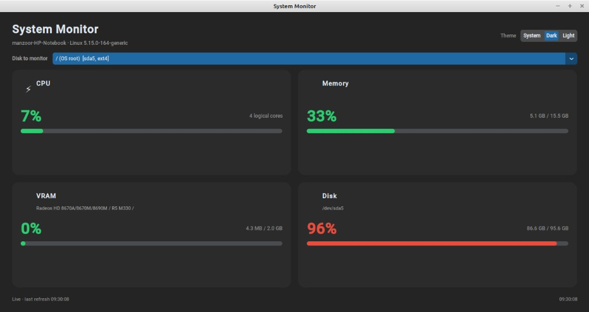

# PulseView - System Monitor

A lightweight desktop app that shows **live CPU, RAM, VRAM, and disk usage** in a single window. Built with Python and [CustomTkinter](https://github.com/TomSchimansky/CustomTkinter) for a clean, modern UI with system / dark / light themes.



## Features

- **One window** — four metric cards in a 2×2 grid with color-coded progress bars
- **Live updates** every second (background polling keeps the UI responsive)
- **Theme control** — System, Dark, or Light appearance
- **Disk picker** — monitor the OS root partition or any other mounted drive
- **GPU support**
  - **NVIDIA** — VRAM via NVML (`nvidia-ml-py`)
  - **AMD (amdgpu)** — VRAM via Linux sysfs
  - **AMD (legacy radeon)** — VRAM via `radeontop`, or total capacity from PCI BAR when `radeontop` is not installed

## Requirements

- Python 3.10+
- Linux (developed and tested on Ubuntu; GPU/disk probing uses Linux-specific paths)
- Optional: `radeontop` for live AMD VRAM % on older `radeon` drivers  
  `sudo apt install radeontop`

## Setup

```bash
git clone https://github.com/ManzoorAhmedShaikh/PulseView
cd n2

python3 -m venv .venv
source .venv/bin/activate

pip install -r requirements.txt
```

## Run

```bash
source .venv/bin/activate
python main.py
```

Or as a module:

```bash
python -m system_monitor
```

## Usage notes

| Metric | Source |
|--------|--------|
| **CPU** | `psutil` — overall usage and logical core count |
| **Memory** | `psutil` — system RAM used / total |
| **VRAM** | NVIDIA NVML, AMD sysfs, or `radeontop` (see above) |
| **Disk** | `psutil` — usage for the mount point selected in the dropdown |

**Disk dropdown** — By default, `/` is the OS root (e.g. `sda5`). You can switch to external or other mounts (e.g. `/mnt/...`) to monitor a different drive.

**VRAM on AMD laptops** — If you only see total VRAM (e.g. `256 MB`) and a note about `radeontop`, install it and restart the app for live used/total and percentage.

## Project layout

```
n2/
├── main.py                 # Entry point
├── requirements.txt
├── docs/
│   └── screenshot.png      # UI preview
└── system_monitor/
    ├── settings.py         # App constants and UI config
    ├── models.py           # Data classes
    ├── utils/              # Formatting and sysfs helpers
    ├── hardware/           # GPU (AMD/NVIDIA) and disk probing
    ├── metrics/            # Metric collection
    └── ui/                 # CustomTkinter widgets and main window
```

## Dependencies

| Package | Purpose |
|---------|---------|
| `customtkinter` | Modern Tkinter UI |
| `psutil` | CPU, RAM, disk stats |
| `nvidia-ml-py` | NVIDIA VRAM (optional if no NVIDIA GPU) |
